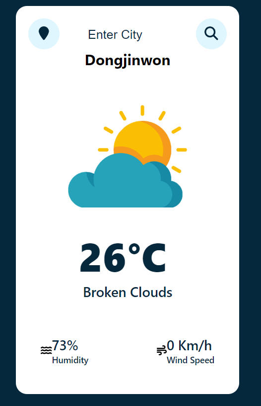

# Weather App 🌤️

A Weather App project created using JavaScript, React, and CSS. The app fetches weather data for the user's current location or a searched city and displays the current weather conditions, including temperature, humidity, and wind speed.

 

## Developer

|  |
| :----------------------------------------------------------------------------------------: |
|              Sung U Jung [@SungJung0616](https://github.com/SungJung0616)              |

 

## Deployment Address

[Weather App](https://sj-cityweatherapp.netlify.app/)

## Stacks

### Environment

 

### Config

### Development

  

### Deployment

 

## Features

### JavaScript Utilization

- **APIs**: OpenWeatherMap API
- Fetches weather data from the OpenWeatherMap API.
- Gets the user's current location using the Geolocation API.
- Gets the city name using the City Name Location API.
- Displays current weather conditions, including temperature, humidity, and wind speed.

### React Utilization

- Components are designed and organized for reusability and manageability.
- State management using useState Hook to track the city, weather data, and UI states.
- useEffect Hook to handle data fetching and state updates.
- Props to pass state values for rendering components.

### CSS Utilization

- The design and responsive work are done using CSS for a visually appealing interface.
- Animations and styles to enhance user experience.
